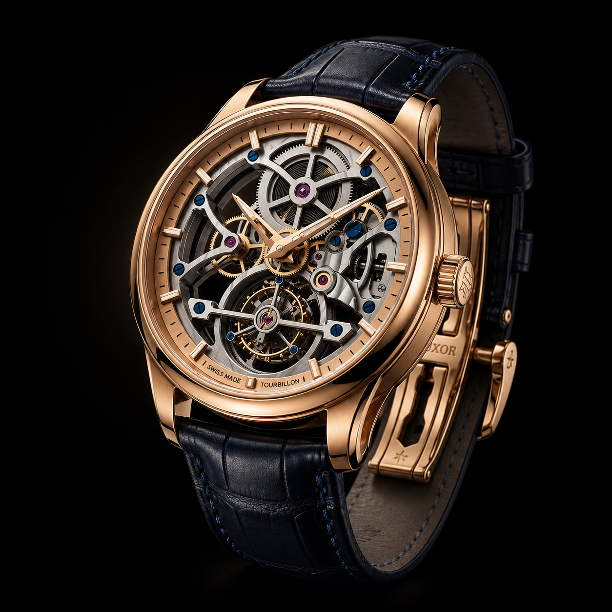

  

<h1 align="center">✦ LUXORA ✦</h1>

  <strong>Swiss Luxury Watch Brand Website</strong> 
  A premium, cinematic, fully responsive brand experience.

  <a>Features</a> •
  <a>Tech Stack</a> •
  <a>Getting Started</a> •
  <a>Live Demo</a> •
  <a>Designer</a>

---

## ✦ Overview

**LUXORA** is a fictional Swiss luxury watchmaker. This website captures the essence of haute horlogerie – dark, elegant, minimal, and sophisticated. Built with **React** and **pure CSS**, it features smooth scroll animations, interactive watch cards, dedicated product pages, and a bespoke reservation system.

---

## ✦ Features

- **Premium Dark Design** – Obsidian black + champagne gold palette
- **Cinematic Hero** – floating watch with 3D mouse‑follow effect
- **Smooth Scroll & Reveal** – all sections fade and slide on entry
- **Watch Collection** – 3 interactive cards, each linking to a detail page
- **Watch Detail Pages** – movement specs, complications, limited‑edition badges
- **Bespoke Reservation** – form with validation and success feedback
- **Support Page** – concierge cards, FAQ accordion, contact form
- **Brand Story** – timeline, statistics, atelier imagery
- **Fully Responsive** – desktop, tablet, mobile
- **Custom Golden Cursor** – adds a luxury feel (desktop only)

---

## ✦ Tech Stack 

| Technology | Purpose |
|------------|---------|
| React 18 | Component‑based UI |
| React Router 6 | Client‑side routing |
| Vite | Fast dev server & build tool |
| CSS3 | Custom styles (no Tailwind/Bootstrap) |
| Google Fonts | Cormorant Garamond (serif) + Inter (sans) |

---

<h2>✦ Live Demo</h2>

  

<a href="https://luxxoraa.netlify.app/">🔗 View Live Demo</a>

## ✦ Designer

**Shubham Bisht**

*Built with passion for luxury horology.*

---

### 📄 License

This project is for demonstration/portfolio purposes only.
All content (text, watch names, and brand story) is fictional.

 

✦ LUXORA – Time, Perfected. ✦

